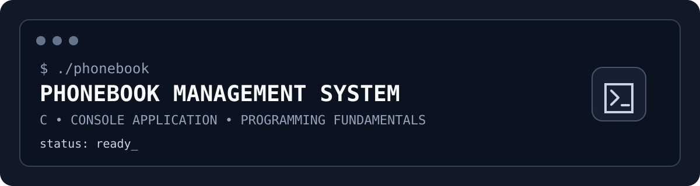

  
  
  

---

## `01` · Overview

**PF-Project** is a console-based phonebook management system developed in **C** for a Programming Fundamentals group project.

It provides a menu-driven interface for creating, viewing, searching, updating, and deleting contacts during a program session.

> **Storage note:** Contacts are held in memory only. No file or database persistence is implemented, so contact data is lost when the program exits.

---

## `02` · Feature Set

| Command | Function | What it does |
|:---:|---|---|
| `01` | **Add Contact** | Creates a contact with name, email, and phone number |
| `02` | **Delete Contact** | Finds a contact and removes it after confirmation |
| `03` | **Update Contact** | Modifies existing contact information |
| `04` | **Search Contact** | Searches by name, email, or phone number |
| `05` | **Clear Contacts** | Removes all stored contacts after confirmation |
| `06` | **Display Contacts** | Displays contacts currently stored in memory |
| `07` | **Exit** | Closes the phonebook session |

### Search modes

- **Name** — partial matching is supported.
- **Email** — partial string matching is supported.
- **Phone number** — partial matching is supported.

When several contacts match, the program displays the matches so the user can select the required contact for operations such as updating or deleting.

---

## `03` · System Map

~~~mermaid
flowchart TD
    A["PHONEBOOK SYSTEM"] --> B["Main Menu"]
    B --> C["Add"]
    B --> D["Search"]
    B --> E["Update"]
    B --> F["Delete"]
    B --> G["Clear"]
    B --> H["Display"]
    B --> I["Exit"]

    D --> D1["By Name"]
    D --> D2["By Email"]
    D --> D3["By Phone"]

    C --> M[("In-Memory Contacts")]
    D --> M
    E --> M
    F --> M
    G --> M
    H --> M
~~~

---

## `04` · Data Model

The project uses three fixed-size two-dimensional character arrays:

~~~c
name[1000][100]
email[1000][100]
number[1000][100]
~~~

Each contact occupies the same index across the three parallel arrays.

| Property | Implementation |
|---|---|
| Maximum contacts | **1,000** |
| Field size | **100 characters** per field |
| Storage | **In-memory** |
| Structure | **Fixed-size 2D character arrays** |
| Dynamic allocation | **Not used** |
| Persistent storage | **None** |

---

## `05` · Program Flow

~~~mermaid
flowchart LR
    U["User"] --> M["Main Menu"]
    M --> O["Select Operation"]
    O --> V{"Operation"}
    V --> A["Add"]
    V --> S["Search"]
    V --> E["Update"]
    V --> D["Delete"]
    V --> C["Clear"]
    V --> P["Display"]
    A --> R["Return to Menu"]
    S --> R
    E --> R
    D --> R
    C --> R
    P --> R
    R --> M
~~~

The interface also uses pauses and screen clearing between menu operations to keep the console interaction readable.

---

## `06` · Project Structure

~~~text
PF-Project/
├── README.md
├── assets/
│   └── terminal-banner.svg
├── src/
│   ├── AddContact.c
│   ├── ClearContacts.c
│   ├── DeleteContact.c
│   ├── DisplayContacts.c
│   ├── SearchByEmail.c
│   ├── SearchByName.c
│   ├── SearchByNumber.c
│   ├── UpdateContact.c
│   └── main.c
└── submission/
    └── FINAL.c
~~~

<b>Source file responsibilities</b>

| File | Responsibility |
|---|---|
| <code>main.c</code> | Program entry point and main menu |
| <code>AddContact.c</code> | Adding and validating contacts |
| <code>DeleteContact.c</code> | Finding and deleting contacts |
| <code>UpdateContact.c</code> | Updating existing contact information |
| <code>SearchByName.c</code> | Searching by name |
| <code>SearchByEmail.c</code> | Searching by email |
| <code>SearchByNumber.c</code> | Searching by phone number |
| <code>DisplayContacts.c</code> | Displaying stored contacts |
| <code>ClearContacts.c</code> | Clearing all stored contacts |

<b>Why is FINAL.c separate?</b>

<code>submission/FINAL.c</code> is the <strong>consolidated version</strong> of the project. It contains the main program and all functions combined into one C source file.

The <code>src/</code> directory contains the modular version, where the functionality is separated across individual source files.

---

## `07` · Console Experience

The README uses a terminal-inspired visual language to reflect the application's actual interface.

For example, the application's interaction model can be represented as:

~~~text
┌──────────────────────────────────────────────┐
│              PHONEBOOK SYSTEM                │
├──────────────────────────────────────────────┤
│  [1] Add Contact                             │
│  [2] Delete Contact                          │
│  [3] Update Contact                          │
│  [4] Search Contact                          │
│  [5] Clear Contacts                          │
│  [6] Display Contacts                        │
│  [7] Exit                                    │
└──────────────────────────────────────────────┘

Enter your choice: _
~~~

> **Motion note:** GitHub READMEs do not reliably support arbitrary CSS or JavaScript animations. The repository therefore uses GitHub-compatible graphics, Mermaid diagrams, expandable sections, and terminal-style visualisation instead of unsupported page animations.

---

## `08` · Build & Run

This repository does not include a build system or dependency manager.

The project is written in standard C source files and can be compiled with a suitable C compiler.

There are two source arrangements:

- **Modular version:** compile the files contained in <code>src/</code> together.
- **Consolidated version:** <code>submission/FINAL.c</code> contains the complete program in one file.

The current implementation is designed around Windows console behaviour, including <code>system("cls")</code>.

---

## `09` · Technologies

- **C**
- **Standard C library**
- **Console-based interface**
- **Functions and modular source files**
- **Fixed-size arrays**
- **String handling**
- **Input validation**

---

## `10` · Implementation Notes

- Contacts exist only for the current program session.
- There is no file or database storage.
- The system supports up to **1,000 contacts**.
- Dynamic memory allocation is not used.
- Exact duplicate contacts are prevented.
- Name, email, and phone searches support partial matching.
- The implementation uses Windows-specific console behaviour.
- The project is therefore **not presented as cross-platform software**.

---

## `11` · Contributors

| Contributor | Contributions |
|---|---|
| **Maryam Saleem** | Main program · Search by phone number · Clear contacts |
| **Aiman Misbah** | Add contact · Search by name · Display contacts |
| **Umaima Manzoor** | Search by email · Delete contact · Update contact |

---

### `END OF SESSION`

<code>✓</code> Programming Fundamentals project  
<code>✓</code> C console application  
<code>✓</code> Contact management system

